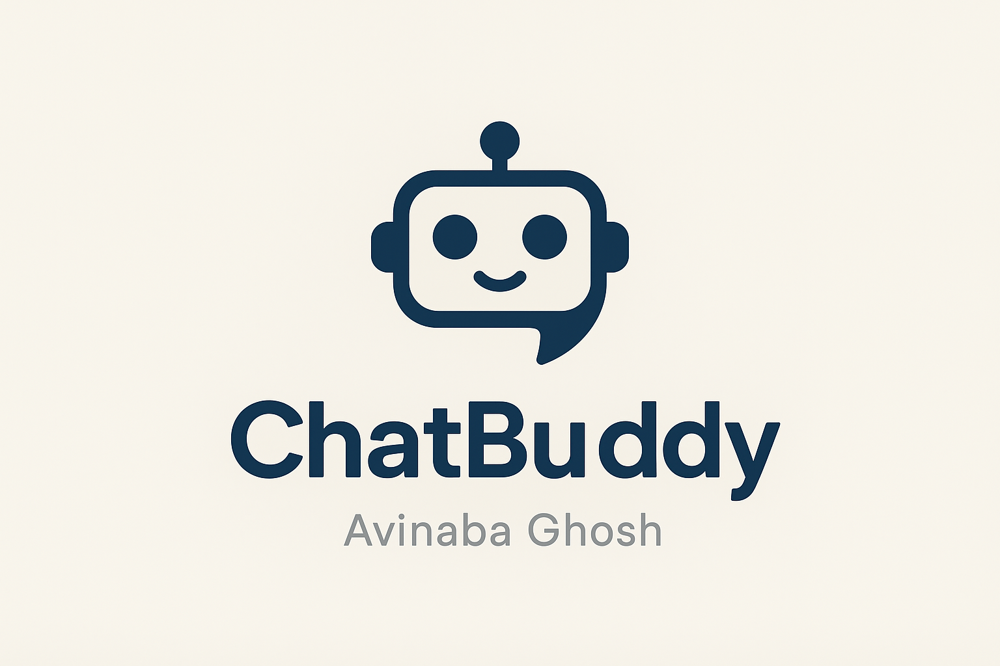

<h1>Chatbot with RAG and LangChain</h1>

<h2>Project on How to create a simple Chatbot with RAG and LangChain</h2>
<div>

<a>
    
</a>
</div>

<h2>Prerequisites</h2>
<ul>
  <li>Python 3.11+</li>
</ul>

<h2>Installation</h2>
<h3>1. Clone the repository:</h3>

```
git clone https://github.com/avinaba333-bit/Project-2025.git
cd Chatbot-with-RAG-and-LangChain
```

<h3>2. Create a virtual environment</h3>

```
python -m venv venv
```

<h3>3. Activate the virtual environment</h3>

```
venv\Scripts\Activate
(or on Mac): source venv/bin/activate
```

<h3>4. Install libraries</h3>

```
pip install -r requirements.txt
```

<h3>5. Add OpenAI API Key</h3>
Rename the .env.example file to .env
Add your OpenAI API Key

<h2>Executing the scripts</h2>

- Open a terminal in VS Code

- Execute the following command:

```
python ingest_database.py
python chatbot.py
```
